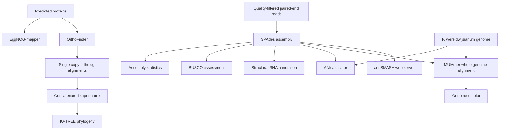

# Comparative genomics and phylogenomics of *Parasarocladium* sp. MA12

[](LICENSE)
[](#citation)

## Overview

This repository contains the code, SLURM job scripts, analysis parameters, and documentation used for the genome assembly, quality assessment, annotation, phylogenomics, and comparative genomic analysis of *Parasarocladium* sp. MA12. It is intended to support the associated publication and provide a transparent record of the computational analyses.

The repository does **not** redistribute raw sequencing reads, third-party genomes, or external databases. Their accession numbers and sources should be reported in the associated article and in `docs/data_availability.md`.

## Workflow



## Repository structure

```text
.
├── README.md
├── CITATION.cff
├── LICENSE
├── CHANGELOG.md
├── config/
├── data/                       # user-supplied input files; not tracked
├── docs/
├── results/                    # generated outputs; not tracked
└── scripts/
    ├── original/               # original analysis scripts, preserved verbatim
    ├── 01_assembly/
    ├── 02_quality/
    ├── 03_annotation/
    ├── 04_phylogenomics/
    ├── 05_comparative_genomics/
    └── 06_visualization/
```

## Computational environment

The analyses were run on an HPC system managed with SLURM. Software was loaded through environment modules. Recorded versions include SPAdes 3.15.4, BBMap 37.36, EggNOG-mapper 2.1.6, MUMmer 4.0.0beta2, tRNAscan-SE 2.0.5, ANIcalculator 1.0.0, and IQ-TREE 3.0.1. The BUSCO and OrthoFinder module names did not encode versions in the original scripts; exact versions should be recovered from the execution logs or module metadata before archival release.

See [`docs/software_and_parameters.md`](docs/software_and_parameters.md).

## Input data

Place local input files under `data/` or provide paths through environment variables. The main expected inputs are:

| Input | Default example | Description |
|---|---|---|
| Paired-end reads | `data/raw/MA12_L1_1_val_1.fq.gz`, `data/raw/MA12_L1_2_val_2.fq.gz` | Quality-filtered Illumina reads |
| MA12 assembly | `results/assembly/MA12_medusa.fasta` | Assembly used for downstream analyses |
| Predicted proteins | `data/proteins/MA12.faa` | Protein FASTA used for annotation and orthology |
| Comparative proteomes | `data/proteomes/` | One protein FASTA per taxon for OrthoFinder |
| Reference genome | `data/genomes/P_wereldwijsianum.fasta` | Genome of *P. wereldwijsianum* |

## Running the workflow

Create the expected folders:

```bash
mkdir -p logs data/{raw,proteins,proteomes,genomes} results
```

Submit the required stages with SLURM. Jobs are intentionally not chained because several steps require inspection or preparation of intermediate files.

```bash
sbatch scripts/01_assembly/01_spades_assembly.slurm
sbatch scripts/02_quality/02_assembly_stats.slurm
sbatch scripts/02_quality/03_busco.slurm
sbatch scripts/03_annotation/04_eggnog_mapper.slurm
sbatch scripts/03_annotation/05_structural_rna_annotation.slurm
sbatch scripts/04_phylogenomics/06_orthofinder.slurm
sbatch scripts/04_phylogenomics/07_extract_single_copy_alignments.slurm
sbatch scripts/04_phylogenomics/08_concatenate_alignments.slurm
sbatch scripts/04_phylogenomics/09_iqtree.slurm
sbatch scripts/05_comparative_genomics/10_ani.slurm
sbatch scripts/05_comparative_genomics/11_mummer_dotplot.slurm
```

Most standardized scripts accept environment-variable overrides, for example:

```bash
GENOME=/path/to/MA12.fasta sbatch scripts/02_quality/03_busco.slurm
REFERENCE=/path/to/reference.fasta QUERY=/path/to/MA12.fasta   sbatch scripts/05_comparative_genomics/11_mummer_dotplot.slurm
```

Generate publication figures after the corresponding analyses:

```bash
Rscript scripts/06_visualization/12_genome_dotplot.R
Rscript scripts/06_visualization/13_phylogeny.R
```

## antiSMASH analysis

Biosynthetic gene clusters were predicted using the antiSMASH web server rather than a local command-line job. The submission procedure, required metadata, and reporting checklist are documented in [`docs/antismash_web_analysis.md`](docs/antismash_web_analysis.md). The antiSMASH version and selected web options must match the associated manuscript.

## Original and standardized scripts

The `scripts/original/` directory preserves the uploaded analysis files, including original HPC paths and exploratory plotting code. The numbered directories contain cleaned, parameterized versions suitable for public reuse. Scientific parameters were retained where they were explicit; paths and output organization were generalized.

## Reproducibility notes

- External database releases can affect BUSCO, EggNOG-mapper, OrthoFinder, and antiSMASH results.
- Exact database versions and download dates should be reported in the manuscript or release metadata.
- Randomness, thread count, and software-version changes may produce small differences in tree search or reported values.
- The supermatrix script fills a missing taxon sequence within an orthogroup with gaps and records warnings in standard output.

## Data availability

Repository code is not a substitute for deposition of raw reads and the genome assembly in an appropriate sequence archive. Add BioProject, BioSample, SRA, and GenBank/ENA/DDBJ accessions to [`docs/data_availability.md`](docs/data_availability.md) before the manuscript is submitted.

## Citation

Cite the associated article and the archived software release. For a stable citation, create a GitHub release, connect the repository to Zenodo, and use the resulting DOI. Update `CITATION.cff` and `docs/data_summary_text.md` after the DOI is assigned.

## License

Code in the standardized workflow is distributed under the [MIT License](LICENSE). Third-party programs, databases, reference genomes, and outputs remain subject to their respective licenses and terms of use. The files in `scripts/original/` are retained as provenance records; any embedded third-party notices must also be respected.
